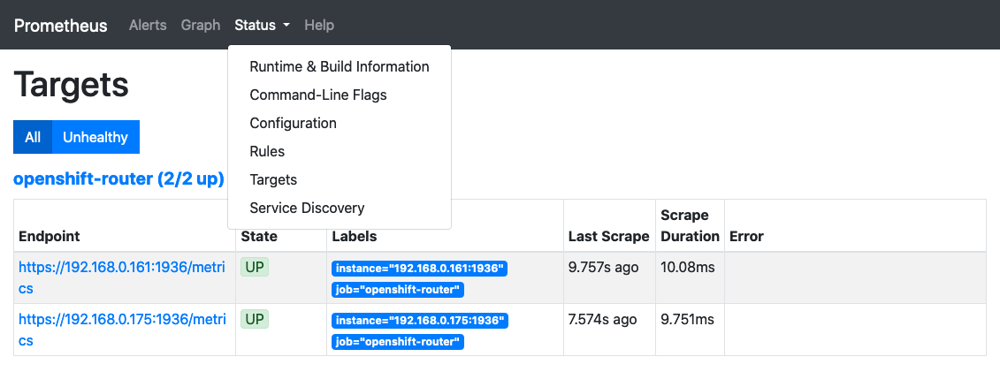
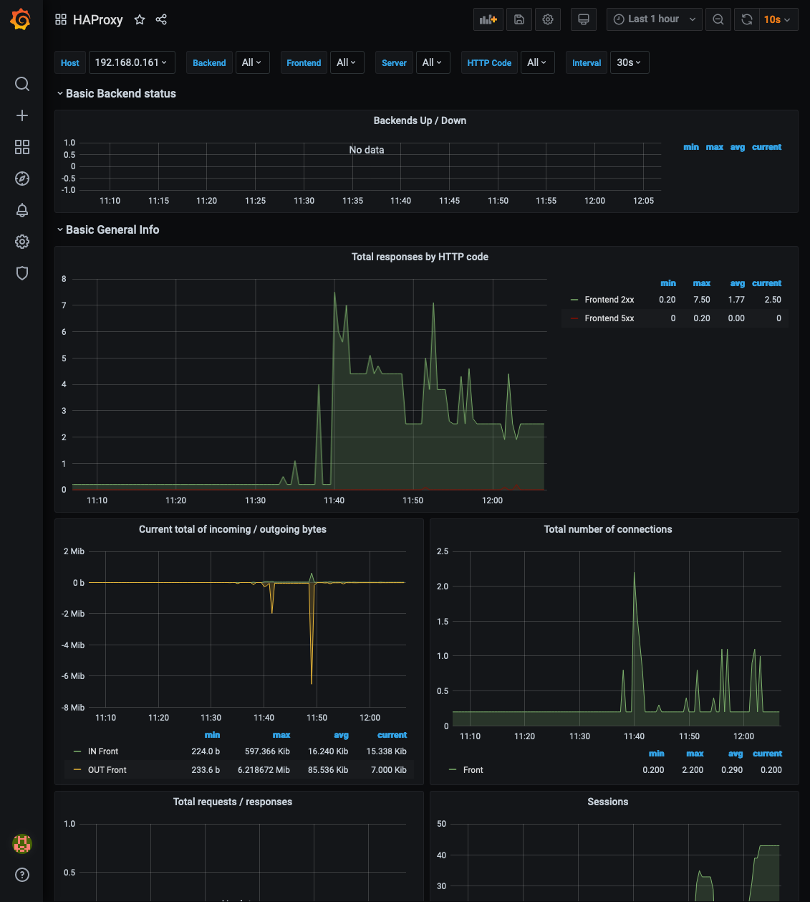

# Visualizing OpenShift HAProxy Router Metrics

Currently, there is an inherited challenge with the default Prometheus Cluster Monitoring stack that ships with Red Hat OpenShift Container Platform 3.11, which it [does not scrape the exposed Prometheus format HAProxy router metrics](https://bugzilla.redhat.com/show_bug.cgi?id=1653532), but addressed and resolved in the later 4.x version.

This blog post will demonstrate a straightforward way on how to visualize the HAProxy Router metrics running in OpenShift Container Platform 3.11. The focus will be using `oc` command CLI to fully deploy the apps without using the WebUI. Web interfaces of Prometheus and Grafana will be utilized at the end to visualize the metrics.

Note that the steps below do not put into the considerations of high availability or security aspects of the deployments, nor utilizing the built-in OAuth server inside OpenShift Container Platform. Additionally, the latest upstream community Prometheus and Grafana images are used. As such, therefore, Red Hat does not provide support for customized solutions that are not shipped with the product. 


## Prerequisites

- An user with `cluster-admin` privilege, e.g: `system:admin`.
- Access to `oc` CLI command, which can connect to the desired cluster.
- The cluster has internet access to pull images from docker.io registry.
- A default `StorageClass` providing dynamic provisioning persistent storage, preferably backed by block storage technology. 
- Basic knowledge of Prometheus and Grafana.


## Login and Project

Login with user `system:admin`, create a project (e.g.: `rmetrics`, short for router metrics) to host the deployments and store the project name into the shell variable `PROJECT`:

```console
# oc login -u system:admin

# oc new-project rmetrics; PROJECT=$(oc project -q)
```

Ensure project `rmetrics` is the current namespace:

```console
# oc project
Using project "rmetrics" on server "https://xyz.example.com:443".
```


## Basic Prometheus Configuration

Create a basic minimal Prometheus configuration in a `ConfigMap` resource for the Prometheus pod to use.

In this example, the intervals for scraping and evaluation are set at 10s. It also has one and only one scrape config job named `openshift-router`.

This scrape config job points to the exposed router metrics target endpoints. It uses `https` protocol, the server name used in the serving TLS certificate is `router.default.svc` and can be verified by the service CA bundle that is automatically mounted in the pods.

It has a static config that points to 3 static targets, each target has an IP and a port of the default exposed router metrics endpoint of each pod. The targets can be extracted dynamically as noted in the yaml, assuming default router deployment and that there are 3 replicas of the router pods. Adjust accordingly to fit desired configuration.

The metrics path is also defined here.

The username and password to access the metrics are also dynamically extracted from the default router deployment.

The `ConfigMap` can be created on the fly:

```console
# oc -n $PROJECT create -f - <<EOF
apiVersion: v1
kind: ConfigMap
metadata:
  name: prometheus-config
  labels:
    app: prometheus
data:
  prometheus.yml: |
    global:
      scrape_interval: 10s
      evaluation_interval: 10s
    scrape_configs:
    - job_name: 'openshift-router'
      scheme: https
      tls_config:
        server_name: router.default.svc
        ca_file: /var/run/secrets/kubernetes.io/serviceaccount/service-ca.crt
      static_configs:
      - targets:
        - $(oc -n default get ep/router -o jsonpath='{.subsets[*].addresses[0].ip}'):$(oc -n default get dc/router -o jsonpath='{..env[?(@.name=="STATS_PORT")].value}')
        - $(oc -n default get ep/router -o jsonpath='{.subsets[*].addresses[1].ip}'):$(oc -n default get dc/router -o jsonpath='{..env[?(@.name=="STATS_PORT")].value}')
        - $(oc -n default get ep/router -o jsonpath='{.subsets[*].addresses[2].ip}'):$(oc -n default get dc/router -o jsonpath='{..env[?(@.name=="STATS_PORT")].value}')
      metrics_path: /metrics
      basic_auth:
        username: $(oc -n default get dc/router -o jsonpath='{..env[?(@.name=="STATS_USERNAME")].value}')
        password: $(oc -n default get dc/router -o jsonpath='{..env[?(@.name=="STATS_PASSWORD")].value}')
EOF
```

Verify result:

```console
# oc -n $PROJECT get cm prometheus-config
NAME                DATA      AGE
prometheus-config   1         18s
```


## Persistent Storage for Prometheus

Providing persistent volume to the Prometheus pod allows it to survive a pod restarted or recreated. It also avoids out of space or quota limitation with default `emptyDir` volume.

Create a `PersistentVolumeClaim` that would utilize the default dynamic provisioning `StorageClass`.

For instance, a `10Gi` claim with `ReadWriteOnce` access:

```console
# oc -n $PROJECT create -f - <<EOF
apiVersion: v1
kind: PersistentVolumeClaim
metadata:
  name: prometheus-data
  labels:
    app: prometheus
spec:
  accessModes:
    - ReadWriteOnce
  resources:
    requests:
      storage: 10Gi
EOF
```

Verify results:

```console
# oc -n $PROJECT get pvc
NAME              STATUS    VOLUME                                     CAPACITY   ACCESS MODES   STORAGECLASS        AGE
prometheus-data   Bound     pvc-2e849223-9980-11ea-ac09-0ab988e0ac13   10Gi       RWO            glusterfs-storage   18s

# oc get pv pvc-2e849223-9980-11ea-ac09-0ab988e0ac13
NAME                                       CAPACITY   ACCESS MODES   RECLAIM POLICY   STATUS    CLAIM                      STORAGECLASS        REASON    AGE
pvc-2e849223-9980-11ea-ac09-0ab988e0ac13   10Gi       RWO            Delete           Bound     rmetrics/prometheus-data   glusterfs-storage             18s
```


## Prometheus Pod

Create the Prometheus pod from the `prom/prometheus` image using `new-app`:

```console
# oc -n $PROJECT new-app prom/prometheus

# oc -n $PROJECT get pod -l app=prometheus
NAME                 READY     STATUS    RESTARTS   AGE
prometheus-1-6jch5   1/1       Running   0          18s
```

Replace the `emptyDir` with the `10Gi` PVC created earlier, thus a new revision of the pod is created:

```console
# oc -n $PROJECT set volume dc/prometheus --add --name=prometheus-volume-1 -t pvc --claim-name=prometheus-data --overwrite

# oc -n $PROJECT get pod -l app=prometheus
NAME                 READY     STATUS    RESTARTS   AGE
prometheus-2-4rhrk   1/1       Running   0          18s
```

Update the `DeploymentConfig`, so that the new revision will:
1. Create a volume which uses the `ConfigMap` that holds the basic Prometheus configuration, `prometheus.yml`.
2. Mount the said volume at `/etc/prometheus/my-config`.
3. Instruct Prometheus to use `/etc/prometheus/my-config/prometheus.yml` instead of the default. 

```console
# oc -n $PROJECT patch dc/prometheus -p '{"spec":{"template":{"spec":{"containers":[{"name":"prometheus","args":["--config.file=/etc/prometheus/my-config/prometheus.yml"],"volumeMounts":[{"name":"prometheus-config-volume","mountPath":"/etc/prometheus/my-config"}]}],"volumes":[{"name":"prometheus-config-volume","configMap":{"defaultMode":420,"name":"prometheus-config"}}]}}}}'

# oc -n $PROJECT get pod -l app=prometheus
NAME                 READY     STATUS    RESTARTS   AGE
prometheus-3-9tgcp   1/1       Running   0          18s
```

Create a route to allow external access:

```console
# oc -n $PROJECT expose svc/prometheus

# oc -n $PROJECT get route/prometheus
NAME         HOST/PORT                                           PATH      SERVICES     PORT       TERMINATION   WILDCARD
prometheus   prometheus-rmetrics.apps.bb12.example.opentlc.com             prometheus   9090-tcp                 None
```


## Data Source for Grafana

Create a basic Grafana data source config in a `ConfigMap` resource for the Grafana pod to use.

In this example, the URL of the `prometheus` type data source is set to the internal service endpoint of the created Prometheus pod using the proxy access.

Additionally, it's set as the default data source and not editable.

```console
# oc -n $PROJECT create -f - <<EOF
apiVersion: v1
kind: ConfigMap
metadata:
  name: grafana-datasources
  labels:
    app: grafana
data:
  prometheus.yaml: |
    apiVersion: 1
    datasources:
    - name: Prometheus
      type: prometheus
      access: proxy
      url: http://prometheus.$PROJECT.svc:9090
      isDefault: true
      editable: false
EOF
```

Verify result:

```console
# oc -n $PROJECT get cm grafana-datasources
NAME                  DATA      AGE
grafana-datasources   1         18s
```


## Dashboard Provider for Grafana

Create a basic Grafana dashboard provider config in a `ConfigMap` resource for the Grafana pod to use.

In this example, a provider named `HAProxy` is hosting the dashboard json file at this path `/var/lib/grafana/dashboards/haproxy`.

```console
# oc -n $PROJECT create -f - <<EOF
apiVersion: v1
kind: ConfigMap
metadata:
  name: grafana-dashboards
  labels:
    app: grafana
data:
  haproxy.yaml: |
    apiVersion: 1
    providers:
    - name: 'HAProxy'
      folder: ''
      type: file
      disableDeletion: true
      editable: false
      allowUiUpdates: true
      options:
        path: /var/lib/grafana/dashboards/haproxy
EOF
```

Verify result:

```console
# oc -n $PROJECT get cm grafana-dashboards 
NAME                 DATA      AGE
grafana-dashboards   1         18s
```


## Prometheus HAProxy Dashboard

There is a nice community built [dashboard](https://grafana.com/grafana/dashboards/2428) for HAProxy router metrics that are exposed in Prometheus format, which will be utilized.

Grab the dashboard json file for HAProxy below version 2.0, adjust it to use the named `Prometheus` data source and create a `ConfigMap` resource out of it for the Grafana pod to use.

```console
# curl https://raw.githubusercontent.com/rfrail3/grafana-dashboards/master/prometheus/haproxy-full.json -o haproxy.json

# sed -i -e 's/${DS_LOCALHOST}/Prometheus/g' haproxy.json

# oc -n $PROJECT create cm grafana-dashboard-haproxy --from-file=haproxy.json
```

Verify result:

```console
# oc -n $PROJECT get cm grafana-dashboard-haproxy
NAME                        DATA      AGE
grafana-dashboard-haproxy   1         18s
```


## Grafana Pod

Create the Grafana pod from the `grafana/grafana` image using `new-app`:

```console
# oc -n $PROJECT new-app grafana/grafana

# oc -n $PROJECT get pod -l app=grafana
NAME              READY     STATUS    RESTARTS   AGE
grafana-1-446fv   1/1       Running   0          18s
```

Update the `Deploymentconfig`, so that the new revision will:
1. Create a volume which uses the `ConfigMap` that holds the Grafana data source, `prometheus.yaml`.
2. Mount the said volume at `/etc/grafana/provisioning/datasources`.
3. Create a volume which uses the `ConfigMap` that holds the Grafana dashboard provider, `haproxy.yaml`.
4. Mount the said volume at `/etc/grafana/provisioning/dashboards`.
5. Create a volume which uses the `ConfigMap` that holds the HAProxy dashboard, `haproxy.json`.
6. Mount the said volume at `/var/lib/grafana/dashboards/haproxy`.

```console
# oc -n $PROJECT patch dc/grafana -p '{"spec":{"template":{"spec":{"containers":[{"name":"grafana","volumeMounts":[{"name":"grafana-datasources-volume","mountPath":"/etc/grafana/provisioning/datasources"}]}],"volumes":[{"name":"grafana-datasources-volume","configMap":{"defaultMode":420,"name":"grafana-datasources"}}]}}}}'

# oc -n $PROJECT patch dc/grafana -p '{"spec":{"template":{"spec":{"containers":[{"name":"grafana","volumeMounts":[{"name":"grafana-dashboards-volume","mountPath":"/etc/grafana/provisioning/dashboards"}]}],"volumes":[{"name":"grafana-dashboards-volume","configMap":{"defaultMode":420,"name":"grafana-dashboards"}}]}}}}'

# oc -n $PROJECT patch dc/grafana -p '{"spec":{"template":{"spec":{"containers":[{"name":"grafana","volumeMounts":[{"name":"grafana-dashboard-haproxy-volume","mountPath":"/var/lib/grafana/dashboards/haproxy"}]}],"volumes":[{"name":"grafana-dashboard-haproxy-volume","configMap":{"defaultMode":420,"name":"grafana-dashboard-haproxy"}}]}}}}'

# oc -n $PROJECT get pod -l app=grafana
NAME              READY     STATUS    RESTARTS   AGE
grafana-4-2bpf8   1/1       Running   0          18s
```

Create a route to allow external access:

```console
# oc -n $PROJECT expose svc/grafana

# oc -n $PROJECT get route/grafana
NAME      HOST/PORT                                        PATH      SERVICES   PORT       TERMINATION   WILDCARD
grafana   grafana-rmetrics.apps.bb12.example.opentlc.com             grafana    3000-tcp                 None
```


## Prometheus Targets

Connect to the Prometheus instance via its exposed route, make sure its targets are up and running.




## Grafana HAProxy Dashboard

Connect to the Grafana instance via its exposed route.

For the first time access, the default administrator credential is admin/admin, new password change will be prompted.

Click `Home` at the top left corner and select the `HAProxy` dashboard.




## Summary

In this post, it shows that it's fairly easy to visualize the already exposed HAProxy router metrics by deploying a simple basic custom Prometheus and Grafana stack. One can further expands on the idea to build a more robust, high availability stack with additional security considerations.   


## References

1. https://docs.openshift.com/container-platform/3.11/install_config/router/default_haproxy_router.html#exposing-the-router-metrics
2. https://prometheus.io/docs/prometheus/latest/getting_started/
3. https://grafana.com/docs/grafana/latest/
4. https://grafana.com/grafana/dashboards/2428, https://github.com/rfrail3/grafana-dashboards


